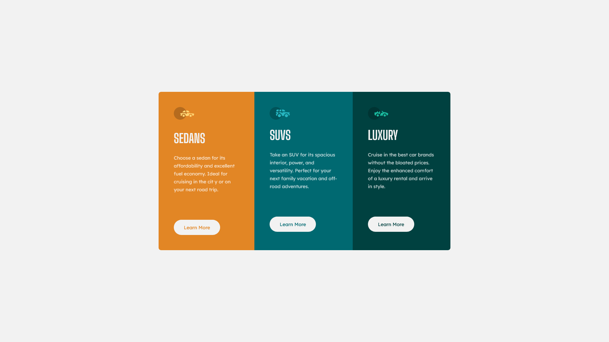

# Frontend Mentor - 3-column preview card component solution

This is a solution to the [3-column preview card component challenge on Frontend Mentor](https://www.frontendmentor.io/challenges/3column-preview-card-component-pH92eAR2-). Frontend Mentor challenges help you improve your coding skills by building realistic projects.

## Table of contents

- [Overview](#overview)
  - [The challenge](#the-challenge)
  - [Screenshot](#screenshot)
  - [Links](#links)
- [My process](#my-process)
  - [Built with](#built-with)
  - [Continued development](#continued-development)
  - [Useful resources](#useful-resources)
- [Author](#author)

## Overview

### The challenge

Users should be able to:

- View the optimal layout depending on their device's screen size
- See hover states for interactive elements

### Screenshot

<!-- 
 -->

### Links

- Solution URL: [Frontend Mentor](https://your-solution-url.com)
- Live Site URL: [Netlify](https://your-live-site-url.com)

## My process

### Built with

- Semantic HTML5 markup
- Flexbox
- Mobile-first workflow
- [React](https://reactjs.org/) - JS library
- [Vite](https://vitejs.dev/) - Frontend Tooling

### Continued development

In this study, I used very simple technologies, I did not use anything new, but I want to try and learn css-in-js frameworks in the future.

### Useful resources

- [MDN](https://developer.mozilla.org/en-US/) - MDN Web Docs is an open-source, collaborative project documenting Web platform technologies, including CSS, HTML, JavaScript, and Web APIs. We also provide an extensive set of learning resources for beginning developers and students.

## Author

- Frontend Mentor - [@VeliCanAydin](https://www.frontendmentor.io/profile/VeliCanAydin)
- LinkedIn - [Veli Can Aydin](https://www.linkedin.com/in/velicanaydin/)
