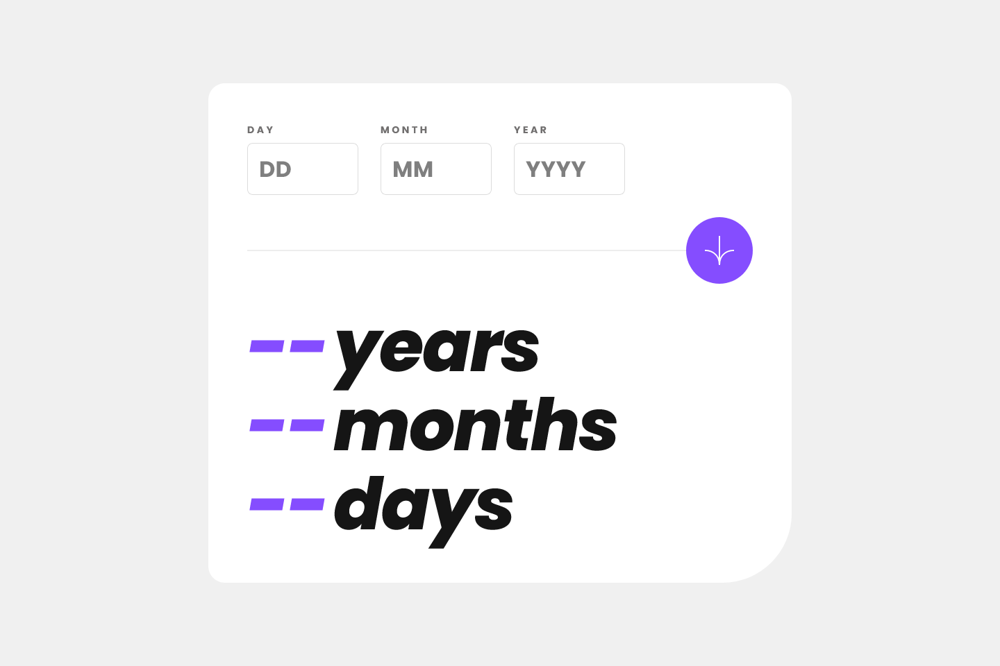
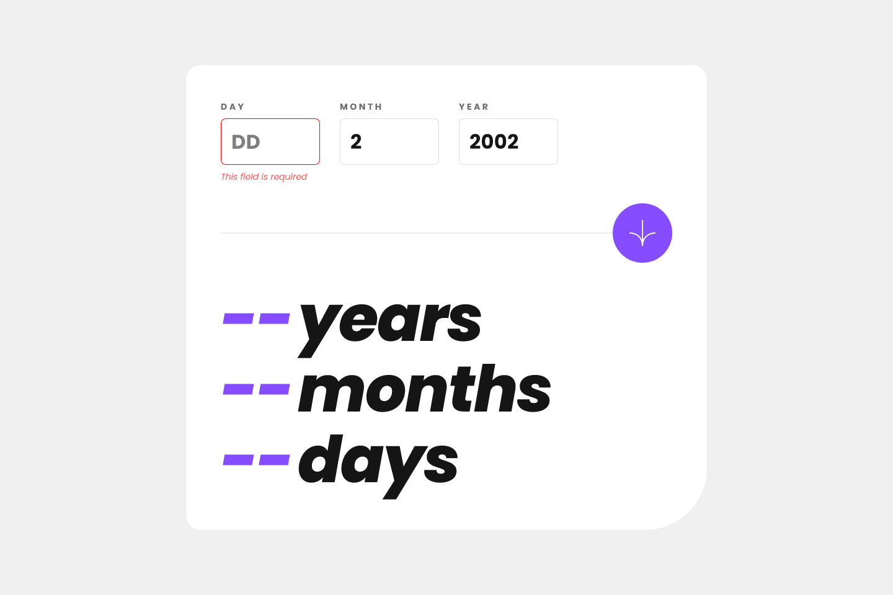
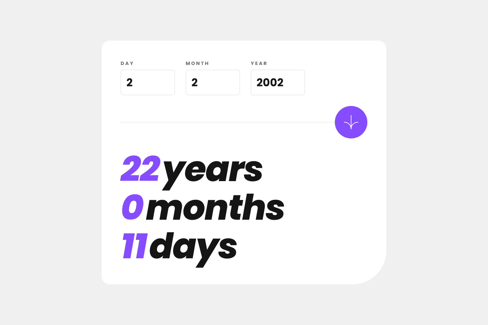
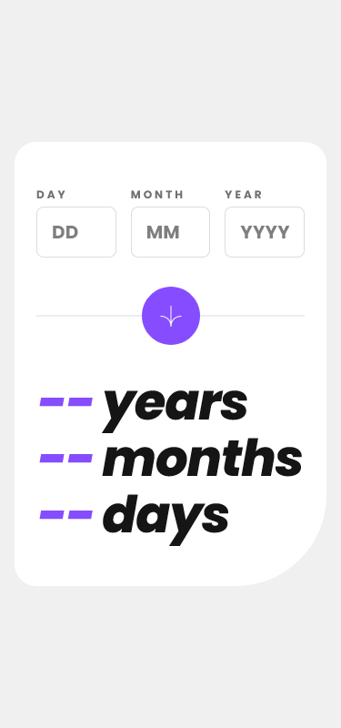

# Frontend Mentor - Age calculator app solution

This is a solution to the [Age calculator app challenge on Frontend Mentor](https://www.frontendmentor.io/challenges/age-calculator-app-dF9DFFpj-Q). Frontend Mentor challenges help you improve your coding skills by building realistic projects.

## Table of contents

- [Overview](#overview)
  - [The challenge](#the-challenge)
  - [Screenshot](#screenshot)
  - [Links](#links)
- [My process](#my-process)
  - [Built with](#built-with)
  - [What I learned](#what-i-learned)
  - [Continued development](#continued-development)
  - [Useful resources](#useful-resources)
- [Author](#author)

**Note: Delete this note and update the table of contents based on what sections you keep.**

## Overview

### The challenge

Users should be able to:

- View an age in years, months, and days after submitting a valid date through the form
- Receive validation errors if:
  - Any field is empty when the form is submitted
  - The day number is not between 1-31
  - The month number is not between 1-12
  - The year is in the future
  - The date is invalid e.g. 31/04/1991 (there are 30 days in April)
- View the optimal layout for the interface depending on their device's screen size
- See hover and focus states for all interactive elements on the page
- **Bonus**: See the age numbers animate to their final number when the form is submitted

### Screenshot






### Links

- Solution URL: [Frontend Mentor](https://your-solution-url.com)
- Live Site URL: [Netlify](https://your-live-site-url.com)

## My process

With this project, I had a beginner level knowledge of how to handle forms in React applications. I especially tried not to use a library (like formik or react-hook-form) because libraries slow down your learning curve and squeeze you into a narrow space. The

```js
new FormData();
```

structure I came across while trying to create this project is quite useful. Although I didn't use it in this project, it looks like I can use it in my future projects.

### Built with

- Semantic HTML5 markup
- CSS custom properties
- Flexbox
- Mobile-first workflow
- [React](https://reactjs.org/) - JS library
- [Vite](https://vitejs.dev/) - Frontend Tooling

### What I learned

I learnt React's `useEffect()` hook to create the counter animation that appears on the screen after the age calculation. I also learnt in this project that all the properties of an object in an array like `{...input}` can be passed to a component as a prop.

### Continued development

Even though I think I have successfully designed and coded this small application, I still don't know how to handle forms with React. I have already left the form validation features unfinished in the project and I will come back to it in the future when I learn more. I need to learn how to handle and validate forms with React better in the future and this is a really complex problem with no single answer.

### Useful resources

- [Lama Dev React Forms Tutorial](https://youtu.be/tIdNeoHniEY) - It is a nice and clean explanation of how you can handle forms with React without using a library, but it is insufficient in complex scenarios. Still, it gave me a good perspective.
- [ChatGPT](https://www.example.com) - I used an AI for the first time in this project and it's really incredible. It's like pair programming with a senior. I ask him questions at every point I have in mind and I can have him explain the parts I don't understand over and over again, and he handles simple tasks for me. AI is definitely something that increases productivity and we can't escape from it, mate.

## Author

- Frontend Mentor - [@VeliCanAydin](https://www.frontendmentor.io/profile/VeliCanAydin)
- LinkedIn - [@Veli Can Aydın](https://www.linkedin.com/in/velicanaydin/)
