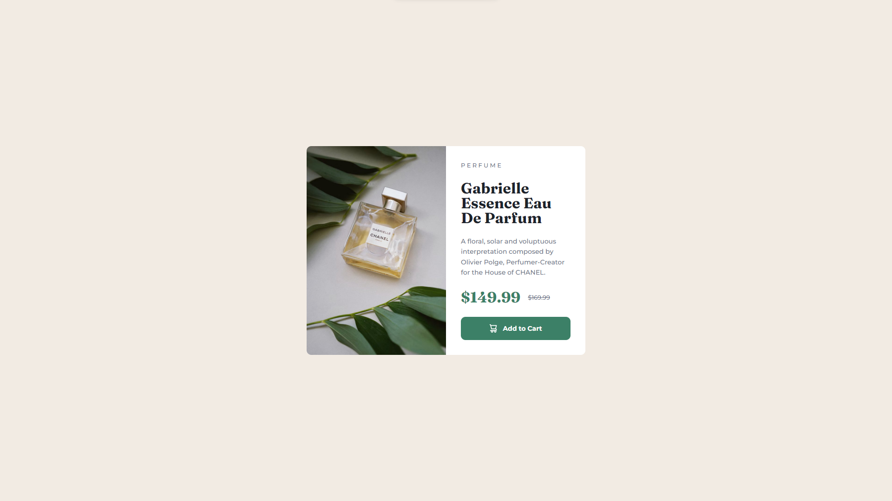

# Frontend Mentor - Product preview card component solution

This is a solution to the [Product preview card component challenge on Frontend Mentor](https://www.frontendmentor.io/challenges/product-preview-card-component-GO7UmttRfa).

## Table of contents

- [Overview](#overview)
  - [The challenge](#the-challenge)
  - [Screenshot](#screenshot)
  - [Links](#links)
- [My process](#my-process)
  - [Built with](#built-with)
  - [What I learned](#what-i-learned)
  - [Continued development](#continued-development)
- [Author](#author)

## Overview

### The challenge

Users should be able to:

- View the optimal layout depending on their device's screen size
- See hover and focus states for interactive elements

### Screenshot



### Links

- Solution URL: [Solution](https://www.frontendmentor.io/solutions/product-preview-card-component-7cc0G3zO7_)
- Live Site URL: [Live](https://cosmic-concha-ba75de.netlify.app/)

## My process

### Built with

- [React](https://react.dev/) - JS library
- Semantic HTML5 markup
- CSS custom properties
- CSS flexbox

### What I learned

In this project, I had the opportunity to repeat the media queries and refreshed my knowledge.

```css
@media screen and (max-width: 767px) {
  .
  .
  .
}
```

### Continued development

In the upcoming challenges, I want to implement much more advanced concepts of react and maybe use a CSS-in-JS framework or a CSS preprocessor like SASS.

## Author

- Frontend Mentor - [@VeliCanAydin](https://www.frontendmentor.io/profile/VeliCanAydin)
- Linkedin - [@Veli Can Aydın](https://www.linkedin.com/in/velicanaydin/)
