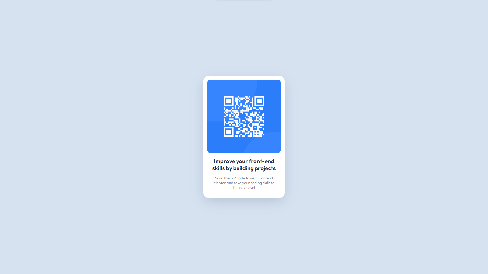

# Frontend Mentor - QR code component solution

This is a solution to the [QR code component challenge on Frontend Mentor](https://www.frontendmentor.io/challenges/qr-code-component-iux_sIO_H). Frontend Mentor challenges help you improve your coding skills by building realistic projects. 

## Table of contents

- [Overview](#overview)
  - [Screenshot](#screenshot)
  - [Links](#links)
- [My process](#my-process)
  - [Built with](#built-with)
  - [What I learned](#what-i-learned)
  - [Continued development](#continued-development)
  - [Useful resources](#useful-resources)
- [Author](#author)
- [Acknowledgments](#acknowledgments)

**Note: Delete this note and update the table of contents based on what sections you keep.**

## Overview

### Screenshot

### Links

- Solution URL: [Frontend Mentor](https://www.frontendmentor.io/solutions/qr-code-component-YlzSZuTjGQ)
- Live Site URL: [Netlify](https://qr-code-component-b500.netlify.app/)

## My process

### Built with

- Semantic HTML5 markup
- Pure CSS
- CSS Flexbox
- [React](https://reactjs.org/) - JS library
- [Vite](https://vitejs.dev/) - Frontend Tooling

### What I learned

I've been doing frontend development for a while so I didn't learn anything new in this example, but for a beginner it might be an opportunity to learn CSS, Flexbox and Semantic HTML.

## Author

- [Frontend Mentor](https://www.frontendmentor.io/profile/VeliCanAydin)
- [Linkedin](https://www.linkedin.com/in/velicanaydin/)