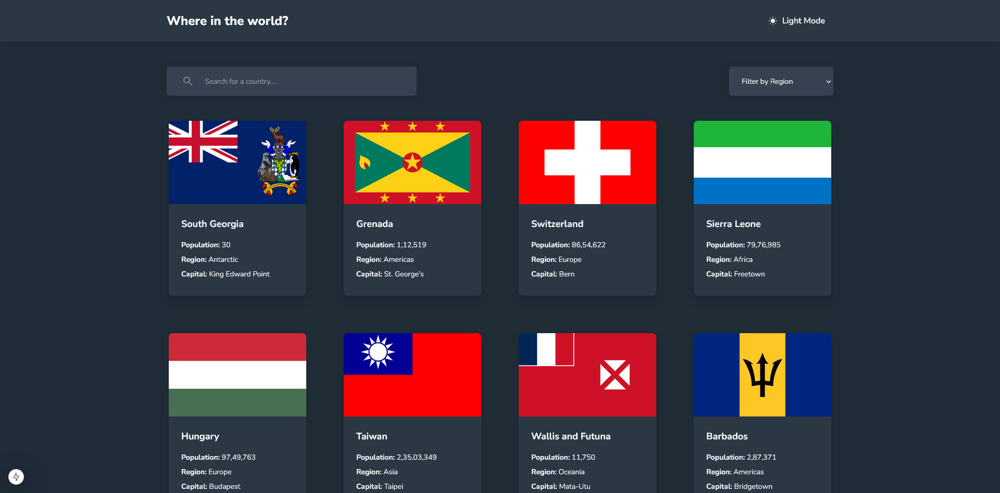
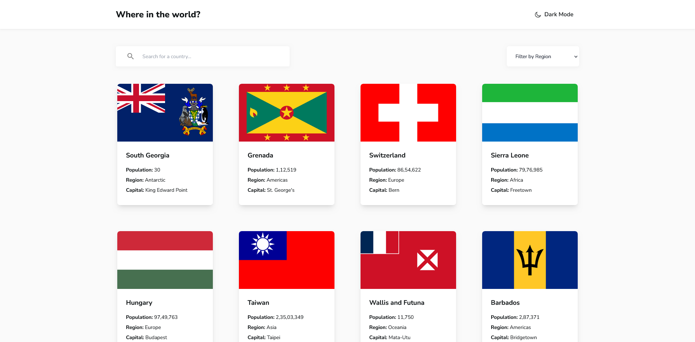
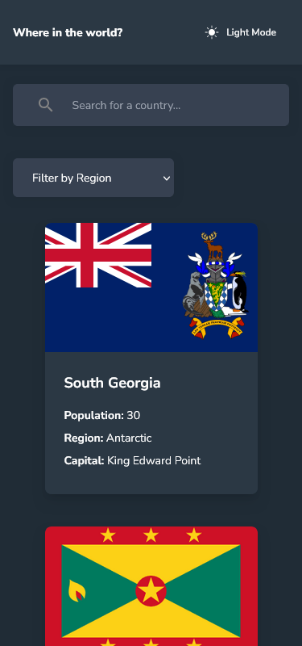
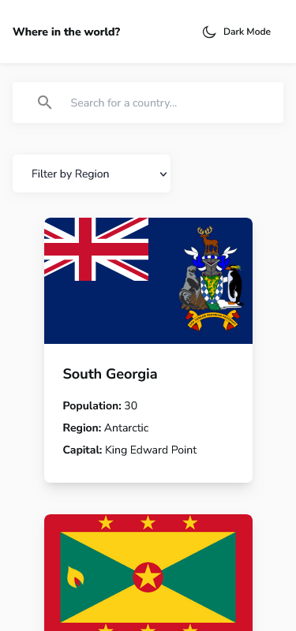

# Frontend Mentor - REST Countries API with color theme switcher solution

This is a solution to the [REST Countries API with color theme switcher challenge on Frontend Mentor](https://www.frontendmentor.io/challenges/rest-countries-api-with-color-theme-switcher-5cacc469fec04111f7b848ca). Frontend Mentor challenges help you improve your coding skills by building realistic projects.

## Table of contents

- [Overview](#overview)
  - [The challenge](#the-challenge)
  - [Screenshot](#screenshot)
  - [Links](#links)
- [My process](#my-process)
  - [Built with](#built-with)
  - [What I learned](#what-i-learned)
  - [Continued development](#continued-development)
  - [Useful resources](#useful-resources)
- [Author](#author)

## Overview

### The challenge

Users should be able to:

- See all countries from the API on the homepage
- Search for a country using an input field
- Filter countries by region
- Click on a country to see more detailed information on a separate page
- Toggle between light and dark theme

### Screenshot

### Links

- Solution URL: [Solution URL](https://www.frontendmentor.io/solutions/rest-countries-api-with-color-theme-switcher-op1uyTP2oM)
- Live Site URL: [Live Space](https://rest-countries-api-project-cx666.vercel.app/)

## My process

### Built with

- Semantic HTML5 markup
- CSS custom properties
- Flexbox
- CSS Grid
- Mobile-first workflow
- [React](https://reactjs.org/) - JS library
- [Next.js 15](https://nextjs.org/) - React framework
- [Tailwind CSS](https://tailwindcss.com/) - For styles

### What I learned

While working on this project, I learned how to integrate a public API into a Next.js application efficiently. I also improved my understanding of dynamic routing in Next.js and how to handle client-side navigation. Implementing the dark mode toggle using TailwindCSS and Next.js context API was a great learning experience.

### Continued development

- **API handling and data fetching**: Working with APIs is a crucial skill, and you might want to refine your techniques for fetching, caching, or error handling.
- **State management in Next.js**: Explore different state management approaches in Next.js if you faced challenges or see room for improvement.
- **Tailwind CSS customization**: Dive deeper into Tailwind CSS customization to create more unique and tailored designs.
- **Accessibility**: Focus on making your application more accessible to users with disabilities.

### Useful resources

- [Frontend Mentor Documentation on using the REST Countries API](https://www.frontendmentor.io/challenges/rest-countries-api-with-color-theme-switcher-5cacc469fec04111f7b848ca) - This is the challenge brief itself and provides crucial information about the API and the project requirements.
- [Tailwind CSS Documentation](https://tailwindcss.com/docs) - The official documentation for Tailwind CSS is an invaluable resource for understanding and utilizing all its features.
- [Next.js Documentation](https://nextjs.org/docs) - The Next.js documentation is essential for learning and mastering Next.js features and best practices.
- [Example resource on API error handling](https://www.example.com) - Find a resource that helped you understand or implement API error handling effectively.
- [Example resource on state management in React/Next.js](https://www.example.com) - Find a resource that helped you with state management in your project.

## Author

- Frontend Mentor - [@VeliCanAydin](https://www.frontendmentor.io/profile/VeliCanAydin)
