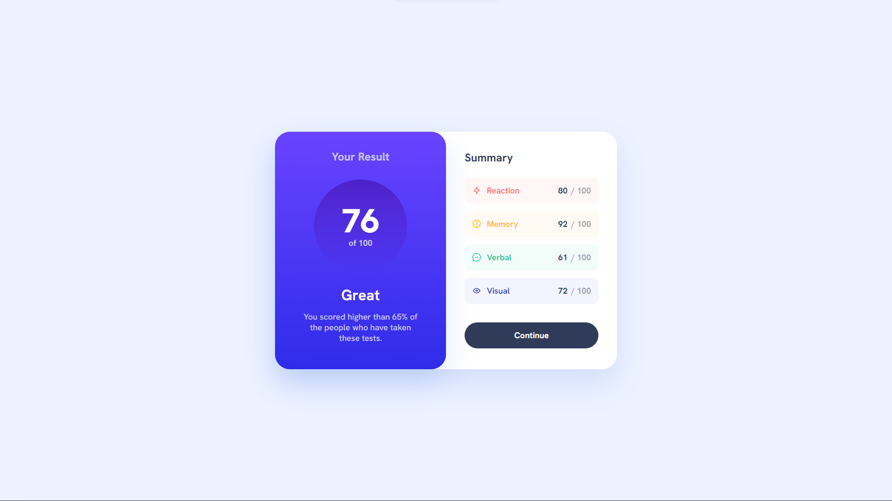
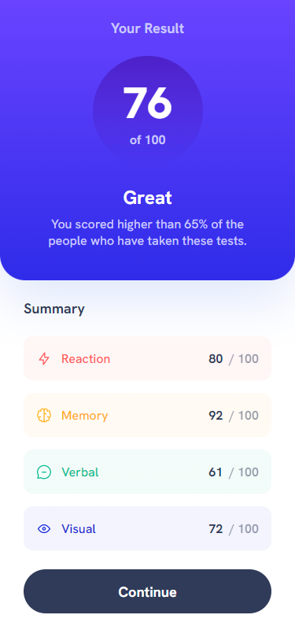

# Frontend Mentor - Results summary component solution

This is a solution to the [Results summary component challenge on Frontend Mentor](https://www.frontendmentor.io/challenges/results-summary-component-CE_K6s0maV).
## Table of contents

- [Overview](#overview)
  - [The challenge](#the-challenge)
  - [Screenshot](#screenshot)
  - [Links](#links)
- [My process](#my-process)
  - [Built with](#built-with)
  - [What I learned](#what-i-learned)
  - [Continued development](#continued-development)
- [Author](#author)

## Overview

### The challenge

Users should be able to:

- View the optimal layout for the interface depending on their device's screen size
- See hover and focus states for all interactive elements on the page

### Screenshot




### Links

- Solution URL: [Solution](https://your-solution-url.com)
- Live Site URL: [Live](https://your-live-site-url.com)

## My process

### Built with

- CSS custom variable
- Flexbox
- Mobile-first workflow
- [React](https://react.dev/) - JS library

### What I learned

In this component I created using React, I saved code and time by using conditional rendering and loops. At the same time, I kept the clean code principle by using CSS variables, saving time and increasing my productivity.

```css
:root {
  --Light-red: hsl(0, 100%, 67%);
}
```

```js
{
  data.map((element) => (
    <Category
      category={element.category}
      icon={element.icon}
      score={element.score}
    />
  ));
}
```

### Continued development
"
In the projects I will develop in the future, I will focus more on responsive design principles and focus on making designs compatible with many more devices. Also, writing cleaner and readable code is something I try to improve in every project.

## Author

- Frontend Mentor - [@VeliCanAydin](https://www.frontendmentor.io/profile/VeliCanAydin)
- LinkedIn - [@VeliCanAydin](https://www.twitter.com/yourusername)
