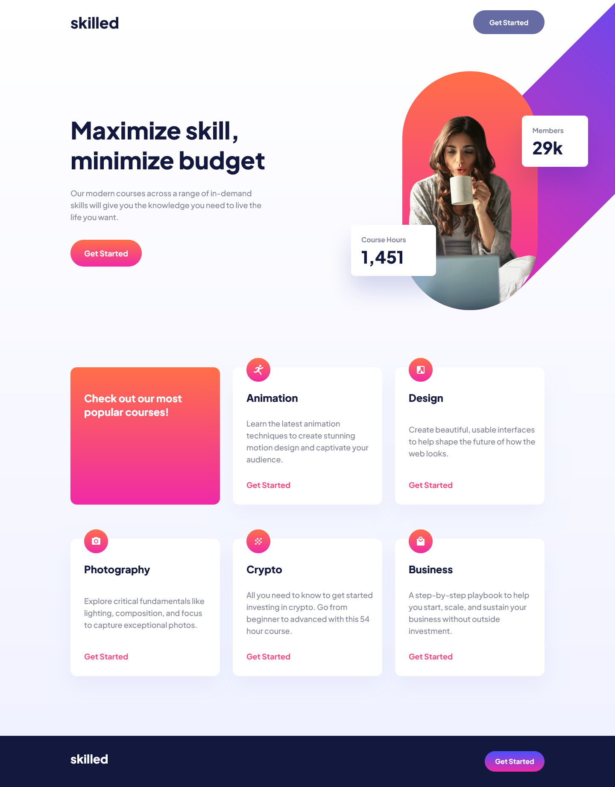
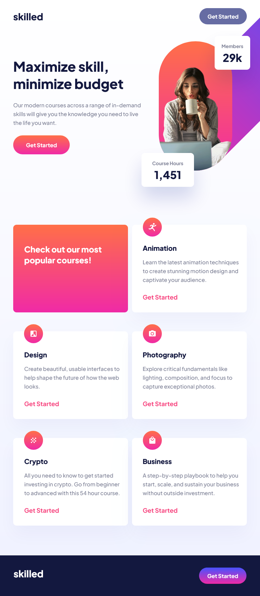
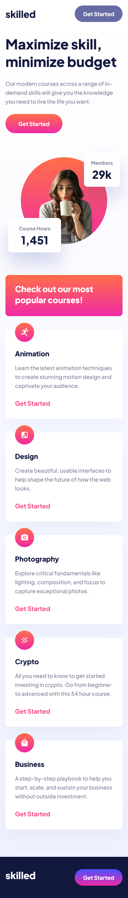

# Frontend Mentor - Skilled e-learning landing page solution

This is a solution to the [Skilled e-learning landing page challenge on Frontend Mentor](https://www.frontendmentor.io/challenges/skilled-elearning-landing-page-S1ObDrZ8q). Frontend Mentor challenges help you improve your coding skills by building realistic projects.

## Table of contents

- [Overview](#overview)
  - [The challenge](#the-challenge)
  - [Screenshot](#screenshot)
  - [Links](#links)
- [My process](#my-process)
  - [Built with](#built-with)
  - [What I learned](#what-i-learned)
  - [Continued development](#continued-development)
- [Author](#author)

## Overview

### The challenge

Users should be able to:

- View the optimal layout depending on their device's screen size
- See hover states for interactive elements

### Screenshot

 

### Links

- Solution URL: [Frontend Mentor](https://www.frontendmentor.io/solutions/skilled-elearning-landing-page-AbNaUO8SMi)
- Live Site URL: [Netlify](https://main--funny-cheesecake-be73ba.netlify.app/)

## My process

In this challenge, I used flexbox layout for the entire site. Using the grid at the bottom of the site where the course cards are located would have provided more advantages and I could have completed the project faster, but I could not predict this at the beginning. In addition, as a result of an approach mistake I made at the beginning of the project, it was impossible for me to add the pictures perfectly to the site. For this reason, I tried to find the original pictures from the internet and recreate the same design with CSS.

### Built with

- Semantic HTML5 markup
- Flexbox
- Mobile-first workflow
- [React](https://reactjs.org/) - JS library
- [Vite](https://vitejs.dev/) - Frontend Tooling

### What I learned

Technically, I didn't learn anything new, but I realized that the choices we'll make as we launch our project need to be made much more carefully. Otherwise, we may encounter much more work in the future.

### Continued development

I need to improve myself on responsive design and aim to write cleaner css. In the next challenges, I have to determine a much more detailed workflow and focus on writing much cleaner code.ques you found useful that you want to refine and perfect.

## Author

- Frontend Mentor - [@VeliCanAydin](https://www.frontendmentor.io/profile/VeliCanAydin)
- LinkedIn - [@LinkedIn](https://www.linkedin.com/in/velicanaydin)
